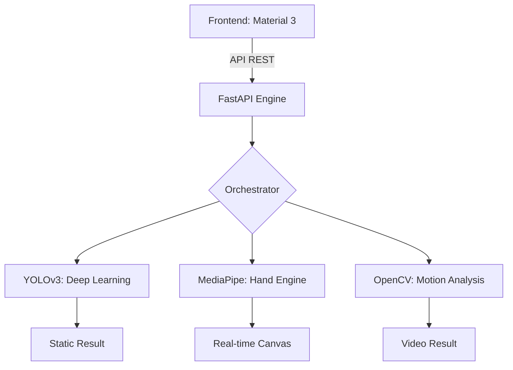

# 🚀 Vision AI Pro Enterprise v2.0


**Vision AI Pro Enterprise** é uma suíte de visão computacional de alto desempenho, projetada com os mesmos padrões de excelência da Google. Unindo **Deep Learning (YOLOv3)** e **Real-time Landmark Tracking (MediaPipe)**, esta plataforma oferece uma experiência de análise visual sem precedentes.

---

## ✨ Funcionalidades "Google Level"

### 📸 Image Insights
- Detecção de objetos ultra-precisa baseada em YOLOv3 (COCO Dataset).
- Renderização de anotações seguindo a paleta **Material Design 3**.
- Chips de estatísticas inteligentes com confiança de detecção.

### 🎥 Video Intelligence
- Processamento assíncrono de frames de vídeo.
- **Detecção de Movimento (MOG2)**: Ideal para monitoramento e segurança avançada.
- Exportação inteligente com overlays técnicos.

### 🖋️ Smart Whiteboard (Powered by MediaPipe)
- **Landmark Hand Tracking**: Rastreio completo dos 21 pontos de referência da mão.
- **Controle por Gestos**: Desenho imersivo usando o dedo indicador.
- **Gesto "Pinch"**: Reset inteligente da lousa ao unir o polegar e o indicador.
- **Zero Latência**: Engine otimizada para processamento direto no navegador via WASM.

### 🎨 Material Design 3 Dashboard
- Interface imersiva (Dark Theme).
- Painel de telemetria: Latência de API, FPS estimado e contadores de objetos.
- Design responsivo e interativo.

---

## 🏗 Arquitetura do Sistema



---

## 🛠 Instalação Profissional

### Via Docker (Recomendado)
```bash
# Build e Run imediato
docker build -t vision-ai-pro .
docker run -p 8000:8000 vision-ai-pro
```

### Instalação Local
1.  **Clone o Repositório:**
    ```bash
    git clone https://github.com/THPL28/vision_computational.git
    cd vision_computational
    ```
2.  **Configuração de Ambiente:**
    ```bash
    python -m venv venv
    ./venv/Scripts/activate  # Windows
    pip install -r requirements.txt
    ```
3.  **Setup de Modelos:**
    O sistema baixará automaticamente os pesos do YOLOv3 no primeiro boot via `prepare_project.py`.

4.  **Execução:**
    ```bash
    uvicorn app.main:app --host 0.0.0.0 --port 8000 --reload
    ```

---

## 🧪 API Documentation
Acesse a telemetria e documentação OpenAPI em:
- **Swagger**: `/api/v2/docs`
- **Health Check**: `/health`

---

## 👨‍💻 Desenvolvedor
**THPL28** - Vision AI Engineer.

---
*Este projeto é software livre sob a licença MIT.*
